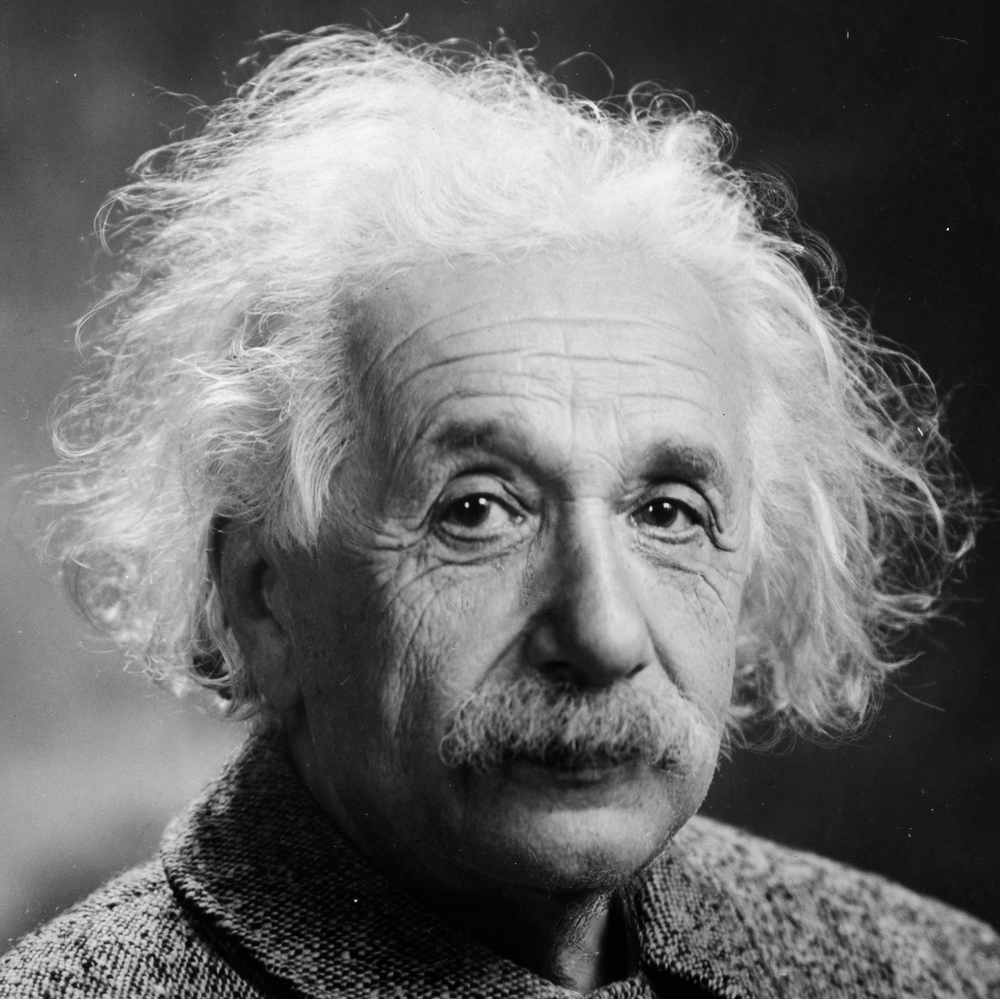
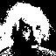
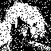
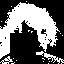
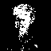
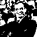
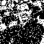
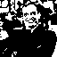

# Hopfield Neural Network

This repository contains my final project for the Programming for Physics course at the University of Bologna (Academic Year 2024/2025).

The project implements a **Hopfield neural network** composed of **4096 neurons**, capable of storing and retrieving binary patterns representing **64×64 black-and-white images**.

The repository includes the entire implementation of the assignment including the **C++ source code**, configuration files, tests, input data, and generated outputs.

## Table of Contents

- [Original Assignment](#original-assignment)
- [Project Description](#project-description)
- [Code Architecture](#code-architecture)
  - [Executables](#executables)
  - [External Dependencies](#external-dependencies)
  - [Error Handling](#error-handling)
- [Repository Structure](#repository-structure)
- [Input/Output and File Formats](#inputoutput-and-file-formats)
- [Testing Strategy](#testing-strategy)
- [Requirements](#requirements)
- [Building and Running](#building-and-running)
- [Results](#results)
- [Use of AI](#use-of-ai)

## Original Assignment

The project was developed based on the assignment provided by the course instructor, which is available [here](https://github.com/Programmazione-per-la-Fisica/progetto2024/blob/main/hopfield.md), and is intentionally not reproduced below.

## Project Description

The network consists of 4096 neurons, corresponding to the pixels of a 64×64 black-and-white image. Each pixel is converted into a binary state, and the resulting image is represented as a binary pattern.

The implementation is organized into **three** logically and operationally **independent main components**, corresponding to the three stages of a Hopfield network's operation:

1. **Acquisition** – conversion of external color image files of arbitrary dimensions and resolution into the internal binary representation (**binary patterns**) used by the network;
<div style="text-align: center;">   </div>

2. **Training** – application of the Hebbian learning rule to the acquired patterns to construct the network memory, represented by a 4096×4096 symmetric **weight matrix**;

3. **Recall** – reconstruction of a corrupted pattern using the already-trained network.

Importantly, the training phase does not need to be repeated every time a new recall experiment is performed.

## Code Architecture

The codebase is written entirely in C++ and is logically divided into **five components**:

| Component | Responsibility |
|-----------|----------------|
| Pattern | Binary representation |
| Acquisition | Image preprocessing |
| Weight Matrix | Network memory |
| Training | Hebbian learning |
| Recall | Pattern reconstruction |

The **Acquisition**, **Training** and **Recall** components implement the three main phases of the Hopfield network. The **Pattern** and **Weight Matrix** components define the data structures and provide the supporting functionality required by the other three components.

Each component typically consists of:
- a header file (`.hpp`);
- an implementation (source) file (`.cpp`);
- a unit test file (`.test.cpp`).

Each header/implementation file pair defines a single class, whose name matches the corresponding file name, together with a set of supporting free functions.

Each of the three main phases also include a dedicated entry-point (`main`) source file (`main_<phase>.cpp`).

### Executables

Each entry-point file produces a separate executable (see [Building and Running](#building-and-running)):
1. `acquisition`
2. `training`
3. `recall`

This choice was made to keep the three main phases of the program mutually independent also from an execution perspective.

1. The acquisition phase processes external images and converts them into binary patterns: this phase can be considered a **preprocessing step** required by the network rather than a direct part of the network's memory dynamics.

2. The training phase reads the previously acquired patterns and constructs the network's weight matrix; as the resulting weight matrix can be stored on disk, training **does not need to be repeated** every time a recall experiment is performed.

3. The recall phase uses the previously generated weight matrix to reconstruct corrupted patterns.

This separation makes it possible to train the network once and perform multiple recall experiments using the already-trained network.

### External Dependencies

The only external dependency is the **Graphics** module of **SFML**, which is employed to convert arbitrary input images into binary patterns and to generate binary images from the acquired patterns.

On Linux systems, it can be installed from the terminal using the following command:

```bash
sudo apt install libsfml-dev
```

### Error Handling

The project adopts a consistent error-handling strategy throughout the codebase, based on the following principles.

- Errors caused by external inputs (such as image or pattern loading failures) are handled by **throwing exceptions** accompanied by **detailed error messages**.

- For all other cases, internal logic errors are detected by an extensive use of `assert` statements to verify preconditions, intermediate conditions, and postconditions. This allows the program to **terminate immediately** in case of an invalid state, preventing errors from propagating.

Although this approach may affect performance in Debug builds, the impact is negligible in Release builds (see [Building and Running](#building-and-running)).

## Repository Structure

The project root directory is `hopfield-neural-network/`, which includes the `CMakeLists.txt` and `.clang-format` configuration files. In addition:
- the header files are stored in the `include/` directory;
- the source files are located in `src/`;
- the three entry-point files are placed in `main/`.

A simplified overview of the initial project structure is:

```text
hopfield-neural-network/
├── CMakeLists.txt
├── .clang-format
├── include/
│   └── ...
├── src/
│   └── ...
├── main/
│   └── ...
├── tests/
│   └── ...
├── images/
│   └── source_images/
└── ...
```

After running the three executables, new directories are generated, which contain the outputs of the three phases (see [Input/Output and File Formats](#inputoutput-and-file-formats)).

```text
hopfield-neural-network/
├── CMakeLists.txt
├── .clang-format
├── include/
│   └── ...
├── src/
│   └── ...
├── main/
│   └── ...
├── tests/
│   └── ...
├── images/
│   ├── source_images/
│   └── binarized_images/
├── patterns/
├── weight_matrix/
├── corrupted_files/
└── ...
```

The `tests/` directory is discussed in section [Testing Strategy](#testing-strategy).

The actual repository structure may contain additional files such as:
- the `.gitignore` configuration file;
- the present `README.md` file and the `README_assets` directory;
- the `build/` directory generated during compilation (see [Building and Running](#building-and-running)).

## Input/Output and File Formats

The program input files are **color images with arbitrary dimensions and resolutions** stored in `images/source_images/`. The supported formats are `.jpg`, `.jpeg`, and `.png`.

1. During the acquisition phase, these images are converted into **binary patterns** (text files with `.txt` extension stored in `patterns/`) and **binarized images** (in `.png` format stored in `images/binarized_images/`).

2. During the training phase, the patterns stored in `patterns/` are used to populate the **weight matrix** using the Hebbian learning rule. The resulting matrix is stored in `weight_matrix/weight_matrix.txt`.

3. During the recall phase, **an existing pattern** is selected and **corrupted** either by removing a rectangular portion or by adding noise. The two corrupted versions are then saved in `corrupted_files/` both as binary patterns and as binary images. Using the previously stored weight matrix from `weight_matrix/`, the program generates the **recall output**, which is saved in `corrupted_files/` both as a binary pattern and as a binary image.

## Testing Strategy

Due to the complexity of the program, which may process a large number of images that would be impractical to handle during testing, and to avoid generating test files inside the regular input/output directories, **dedicated test directories** have been added under `tests/`.

These directories replicate the structure of the main project directories and emulate the behavior of the program during normal execution. In particular, `tests/images/source_images/` contains four test color images.

For this reason, the `Acquisition`, `Training`, and `Recall` classes provide a **constructor overload** that accepts the string `"tests/"`. When this parameter is specified, the reference directory is changed from the project root `hopfield-neural-network/` to the test directory `hopfield-neural-network/tests/`.

The `tests/` directory also contains the `doctest.h` header required by the **doctest** testing framework, which is used to implement all unit tests.

Before executing the test suite, the directories `tests/images/binarized_images/`, `tests/patterns/`, `tests/weight_matrix/`, and `tests/corrupted_files/` **must already exist**, although they do not need to be empty.

Each unit test generates output files. Depending on the tested functionality, these files are either removed during test execution or **intentionally reused** by subsequent tests. Therefore, the tests must be executed **in the same order** in which they are added to the `CMakeLists.txt` file, and modifying this order may cause failures.

Each test file contains checks exclusively for the class and the free functions defined in the corresponding implementation file.

## Requirements

The project requires:
- a C++20-compatible compiler;
- CMake;
- Ninja;
- the Graphics module of SFML.

## Building and Running

The project uses **CMake** as its build system, **Ninja** as the build tool, and requires a **C++20-compatible compiler**. The commands below configure the project using the **Ninja Multi-Config** generator, allowing both the **Debug and Release configurations** to be built from the same build directory.

From the `hopfield-neural-network/` directory, the following commands can be used to generate the build directory, compile the executables, and run the tests in both Debug and Release configurations:

```bash
cmake -S . -B build -G"Ninja Multi-Config"
cmake --build build --config Debug
cmake --build build --config Debug --target test
cmake --build build --config Release
cmake --build build --config Release --target test
```

The generated build directory is created inside `hopfield-neural-network/`.

To run the `acquisition` executable, for example, execute the following commands from the project root:

```bash
cd build/
Debug/acquisition # for a Debug build
Release/acquisition # for a Release build
```

The same procedure can be followed to run the `training` and `recall` executables.

## Results

The `recall` executable corrupts the `ae.txt` pattern by adding random noise. Other input images, as well as occluded versions of the same image, can also be tested by modifying the source file.

<div style="text-align: center;">   </div>

In the current configuration, the network is unable to reconstruct the original pattern. Instead, it converges to a different stable state with a lower energy than that of the expected pattern.

<div style="text-align: center;">  </div>

This behavior is likely due to the intrinsic limitations of the Hopfield network, which is known to converge to **spurious states** corresponding to local minima of the energy function. Two possible ways to improve the reconstruction performance are:
- reducing the number of stored patterns, thereby increasing the network capacity available for each memory;
- choosing training images that are more nearly **orthogonal** to one another.

As observed during unit testing, when only the four test patterns are stored in the network, each of them is successfully reconstructed.

<div style="text-align: center;">      </div>

## Use of AI

Artificial Intelligence tools (specifically ChatGPT) were used during the development of this project only to provide feedback on design alternatives proposed during development and to explain the theoretical usage of the SFML Graphics library.

The only AI-generated code included in the project is the bilinear interpolation routine implemented in `acquisition.cpp`, which was adopted after difficulties were encountered in developing an effective implementation for resizing the input images.